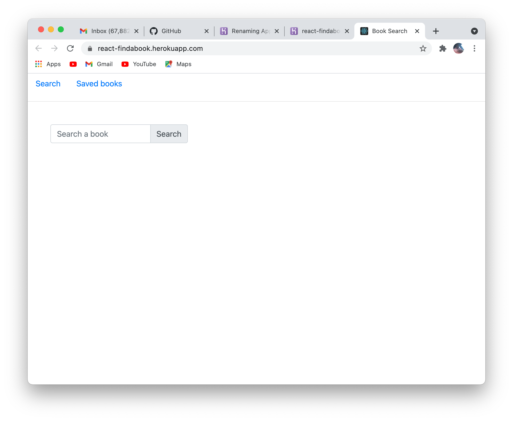
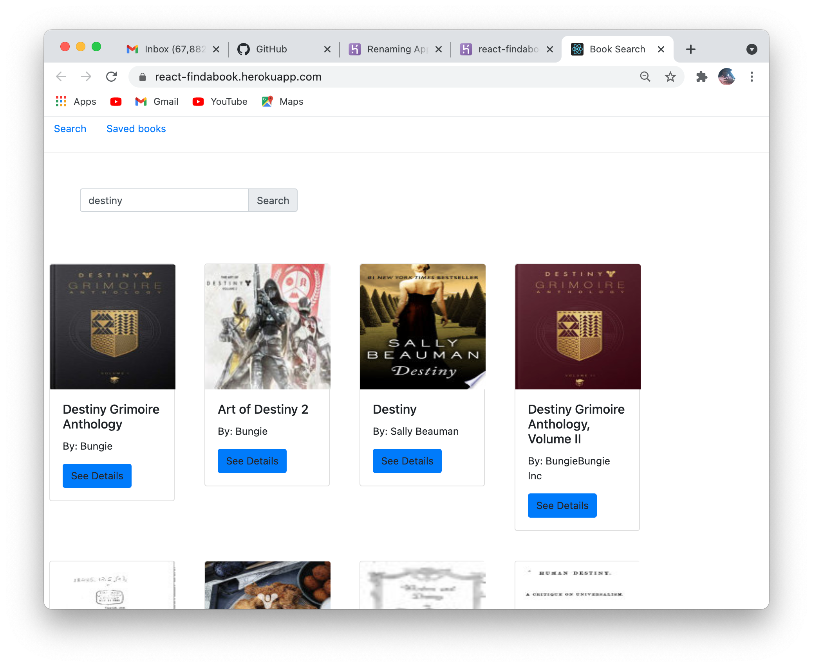
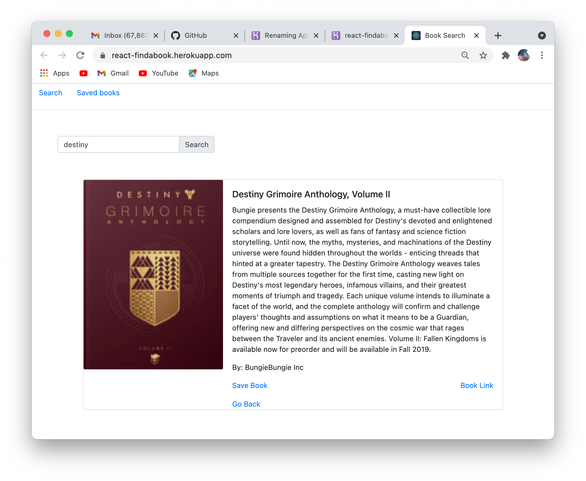

## Project Title

React-Books-Search

## Description

This is an App where the user can search books by name or author and see details about the book if found. The User also has the ability to save books to, or delete books from a collection of saved books.

## Table of Content

1. [Installation requirements](#Installation)
2. [Deployed App](#Deployed)
3. [Contributions](#contribution)
4. [License](#License)
5. [screenshots](#Screenshots)
6. [Questions](#questions)

## Installation

 Google Books API, "Axios", "react", "react-dom", "react-router-dom", "react-scripts", "express", "if-env", "nodemon", "mongoose", "MongoDB"

## Deployed

https://react-findabook.herokuapp.com/

## Contribution

Darius Hay https://github.com/DariusHay

## License

## Screenshots

## Questions

If you have any additional questions about this project, you can find me on GitHub at DariusHay https://github.com/DariusHay, or you can email me at dariushay@gmail.com, thank you.